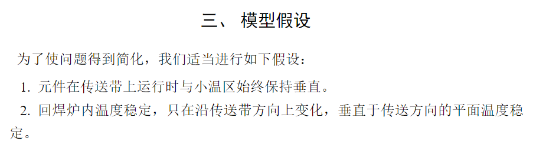
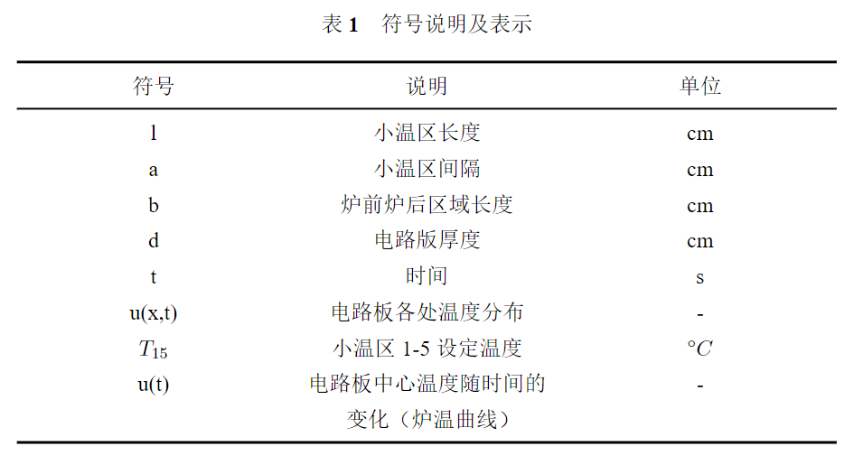
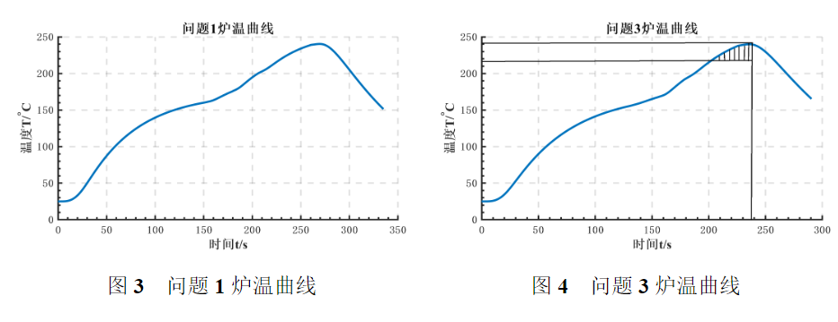

# Cumcmthesis | 基于LaTeX的数模写作模板


<!--more-->
## 基本介绍


cumcmthesis 是为全国大学生数学建模竞赛编写的 LaTeX 模板, 旨在让大家专注于论文的内容写作, 而不用花费过多精力在格式的定制和调整上. 


作者已经将模板开源在 [Github仓库](https://github.com/latexstudio/CUMCMThesis)，随取随用。该模板已经帮我们处理好了大部分论文所需要的格式，正如简介所说的，使用此模板后我们现在只要专注文章内容就可以了。

## 使用方法
### 导入
首先我们需要先将 [Github仓库](https://github.com/latexstudio/CUMCMThesis) clone 下来，然后将其中的 `cumcmthesis.cls` 文件复制到我们 $\LaTeX$ 的工作目录中。然后在 tex 文件开头使用：
```latex
\documentclass[withoutpreface, bwprint]{cumcmthesis}
```

其中，`[withoutpreface, bwprint]` 的功能是去掉封面与编号页。

### 标题
很简单的一行代码：`\title{}`
然后在 `document` 环境中使用 `\maketitle` 即可。

### 摘要
```latex
\begin{abstract}
some contents
\keywords{foo_1 \quad foo_2}
\end{abstract}
```

### 正文
普通文字分章节正常使用 `\section` 和 `\subsection` 即可。
模板已经自动帮我们设定好了首行的缩进单位。

#### itemize 与 enumerate  缩进
以 enumerate 为例：
```latex
\begin{enumerate}[itemindent=2em]
    \item some items
\end{enumerate}
```
这里的 `itemindent=2em` 设定为缩进两个字符长度。示例如图：


#### table 表格
不得不说表格是 $\LaTeX$ 里最麻烦的东西之一，想要画出一份好表格并不是一件容易的事。$\LaTeX$ 自带的表格并不能很好的实现美观表格，所以需要先导入 `tabularx` 宏包。
下面给出我的表格代码示例：
```latex
\begin{table}[!htbp]
    \caption[symbol]{符号说明及表示}
    \centering
    \begin{tabularx}{\textwidth}{
        >{\centering\arraybackslash}X
        >{\centering\arraybackslash}X
        >{\centering\arraybackslash}X}
    \toprule[1.5pt]
    符号 & 说明 & 单位 \\
    \midrule[1pt]
    \bottomrule[1.5pt]
    \end{tabularx}
\end{table}
```


#### figure 图片
图片是 $\LaTeX$ 中的另一个讨人厌的家伙，尤其是涉及多图排版的时候。
下面分别给出我认为比较美观的图片示意代码：
- **单图排版**：
```latex
\begin{figure}[H]
    \centering
    \label{fig: example}
    \includegraphics[width=0.7\textwidth]{src}
    \caption{example}
\end{figure}
```
- **多图排版（ minipage ）**:
```latex
\begin{figure}[H]
    \begin{minipage}{0.48\linewidth}
        \centering
        \label{fig: foo_1}
        \includegraphics[width=3.01in]{src}
        \caption{foo_1}
    \end{minipage}
    \hfill
    \begin{minipage}{0.48\linewidth}
        \centering
        \label{fig: foo_2}
        \includegraphics[width=3.01in]{src}
        \caption{foo_2}
    \end{minipage}
\end{figure}
```
多图排版示意图：


### 参考文献
参考文献的引用方式在 `cumcmthesis` 中被大大简化了，不需要写 bib 文件，更不需要重复编译四次，只需要一段简短的代码就可以完成：
```latex
\begin{thebibliography}{9}
    \bibitem{1} some contents
\end{thebibliography}
``` 
引用内容也不需要使用特定的 bibtex 格式，用平时 word 中的常见格式就可以。
在文章中要引用的话使用 `\supercite{num}` 即可。

### 附录
```latex
\newpage
\begin{appendices}
    \section{目录结构}
    a figure
    \section{代码}
    some code
    \lstinputlisting[language=code]{src}
\end{appendices}
```

